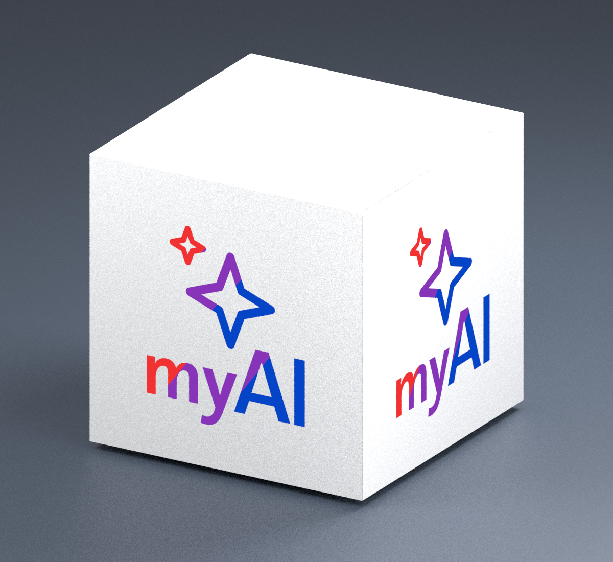

# myAI Cube

Eine kleine Würfellampe zum Selberdrucken: weißes PLA, sanftes Licht und das myAI-Logo mittig auf allen vier Seiten. Entwickelt für den **Bambu Lab P1S** und das **LED Lamp Kit 001 / MH001**.

*Technische Farbansicht der CAD-Geometrie: Die Logos zeigen die nominellen sRGB-Farben ohne Aufhellung durch Beleuchtung. Keine Vorhersage realer Filamentfarben oder Lichtwirkung.*

## Die Idee

Ein **15 × 15 × 15 cm** großer Würfel mit **0,8 mm dünnen Leuchtflächen**, integrierten Logos, Boden mit LED-Aufnahme und abnehmbarem Deckel. Für das Logo gibt es eine farbige AMS-Variante und eine einfarbige Alternative.

## Plane Seiten mit AMS — v4

**Vier vollflächige Seitenplatten, außen ohne Vertiefungen oder vorstehende Rahmen.** Die Befestigung liegt innen; nur schmale Montagefugen bleiben an den Würfelkanten. Die 0,8-mm-Leuchtflächen und Logos sind bündig. Innenliegende Führungsleisten erlauben das Einschieben von oben.

**Für ein AMS mit vier Farben:** Weiß, Blau, Violett und Rot. Sterne und Schriftzug „myAI“ folgen Rot → Violett → Blau als feste Farbstufen. Sechs Farbwechsel pro Platte. [Farbvergleich mit den Original-SVGs](output/multicolor_v4/preview/color_reference.png).

Luft und Kabel führen unter dem Boden hindurch. Vier 4-mm-Druckfüße schaffen Abstand; die Gesamthöhe bleibt **150 mm einschließlich Füßen**. Die obere Entlüftung liegt in der 0,8-mm-Deckelfuge auf der Oberseite. Die Füße werden eingesteckt und angeklebt; die Seitenplatten kommen ohne Klebstoff aus.

[Druckdateien & Montage v4](docs/MEHRFARBIG_V4.md) · [Farbprobe](output/multicolor_v4/print/01_color_test_P1S.3mf) · [Führungs-Passprobe](output/multicolor_v4/print/07_fit_P1S.3mf) · [Komplettpaket v4](output/myAI_Cube_150_P1S_AMS_v4.zip)

Sieben vorbereitete P1S-Projekte, keine Stützen. Lampe ohne Proben laut Slicer etwa **267 g PLA und 17 h 22 min**. Zuerst die neue Führung mit der Passprobe prüfen. [Frühere AMS-Variante v3](docs/MEHRFARBIG_V3.md).

**Stand: Prototyp.** Digital geprüft und geslict. Physischer Probedruck und Temperaturtest stehen noch aus.

## Einfarbige Variante v2 drucken

Die ursprüngliche Variante besteht aus Körper, Boden und Deckel. Das innen verstärkte Logo soll sich im Licht dunkler abzeichnen; kein AMS erforderlich. Diese Variante besitzt noch sichtbare Lüftungsöffnungen.

Die 3MF-Projekte sind ausgerichtet und für **P1S · 0,4-mm-Düse · weißes PLA · strukturierte PEI-Platte** vorbereitet. In Bambu Studio **als Projekt** öffnen, eigenes Filament und Druckplatte prüfen und bei Änderungen neu slicen.

| Zuerst testen | Danach die Lampe drucken |
|---|---|
| [Testplatte: Licht und Passung](output/print/01_tests_P1S.3mf) | [Körper](output/print/02_body_P1S.3mf) · [Boden](output/print/03_base_P1S.3mf) · [Deckel](output/print/04_lid_P1S.3mf) |

**Druckprofil:** 0,20-mm-Schichten, keine Stützen. Die Hauptteile benötigen laut Slicer etwa **238 g PLA und 15 h 42 min**. LED-Kit und eine passende 5-V-USB-Stromversorgung kommen dazu.

**Stand: Prototyp v2.** Geometrie und Slicing sind geprüft; ein physischer Probedruck steht noch aus. Deshalb zuerst Lichtdurchlässigkeit und Passung mit der Testplatte prüfen.

## Weiterbauen

- [Druck & Montage](docs/DRUCK_UND_MONTAGE.md) — vom Probedruck zur fertigen Lampe.
- [Projektdetails](docs/PROJEKTDETAILS.md) — Maße, Druckzeiten, Aufbau und Quellen.
- [CAD & Validierung](docs/CAD_UND_VALIDIERUNG.md) — Konstruktion reproduzieren und prüfen.
- [STL-Dateien](output/stl) · [CAD-Parameter](cad/parameters.json) · [Generator](cad/build.py) — für eigene Anpassungen.
