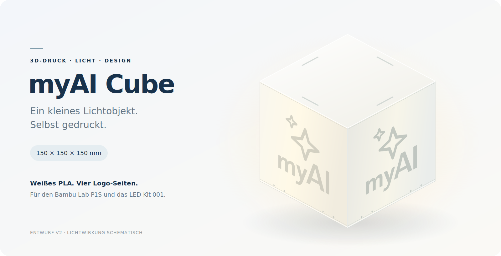

# myAI Cube

Eine kleine Würfellampe zum Selberdrucken: weißes PLA, sanftes Licht und das myAI-Logo mittig auf allen vier Seiten. Entwickelt für den **Bambu Lab P1S** und das **LED Lamp Kit 001 / MH001**.

*Illustration des Entwurfs. Lichtwirkung und Logo-Kontrast sind schematisch.*

## Die Idee

Ein **15 × 15 × 15 cm** großer Würfel aus drei Teilen: Lampenkörper, Boden mit LED-Aufnahme und abnehmbarer Deckel. Die **0,8 mm dünnen Leuchtflächen** lassen Licht durch; das direkt mitgedruckte, innen verstärkte Logo soll sich dunkler abzeichnen. Außen bleibt die Oberfläche glatt. Kein Kleben der Logos, kein AMS erforderlich.

## Neu: mehrfarbig mit AMS

**Prototyp v3 für ein AMS mit vier Farben:** Weiß, Dunkelblau, Hellblau und Rot. Vier identische 0,8-mm-Paneele mit bündig mitgedruckten Logos gleiten in einen weißen Rahmen. Der Logo-Verlauf wird durch feste Farbflächen angenähert. Sechs Farbwechsel pro Paneel; Montage ohne Aufkleben der Logos.

[Druckdateien & Montage v3](docs/MEHRFARBIG_V3.md) · [Kleine Farbprobe](output/multicolor_v3/print/01_color_test_P1S.3mf) · [Komplettpaket v3](output/myAI_Cube_150_P1S_AMS_v3.zip)

*Ansicht der CAD-Geometrie; Lichtwirkung und reale Filamentfarben sind noch nicht getestet. Digital geprüft und geslict, physischer Probedruck ausstehend.*

## Einfarbige Variante v2 drucken

Die 3MF-Projekte sind ausgerichtet und für **P1S · 0,4-mm-Düse · weißes PLA · strukturierte PEI-Platte** vorbereitet. In Bambu Studio **als Projekt** öffnen, eigenes Filament und Druckplatte prüfen und bei Änderungen neu slicen.

| Zuerst testen | Danach die Lampe drucken |
|---|---|
| [Testplatte: Licht und Passung](output/print/01_tests_P1S.3mf) | [Körper](output/print/02_body_P1S.3mf) · [Boden](output/print/03_base_P1S.3mf) · [Deckel](output/print/04_lid_P1S.3mf) |

**Druckprofil:** 0,20-mm-Schichten, keine Stützen. Die Hauptteile benötigen laut Slicer etwa **238 g PLA und 15 h 42 min**. LED-Kit und eine passende 5-V-USB-Stromversorgung kommen dazu.

**Stand: Prototyp v2.** Geometrie und Slicing sind geprüft; ein physischer Probedruck steht noch aus. Deshalb zuerst Lichtdurchlässigkeit und Passung mit der Testplatte prüfen.

## Weiterbauen

- [Druck & Montage](docs/DRUCK_UND_MONTAGE.md) — vom Probedruck zur fertigen Lampe.
- [Projektdetails](docs/PROJEKTDETAILS.md) — Maße, Druckzeiten, Aufbau und Quellen.
- [CAD & Validierung](docs/CAD_UND_VALIDIERUNG.md) — Konstruktion reproduzieren und prüfen.
- [STL-Dateien](output/stl) · [CAD-Parameter](cad/parameters.json) · [Generator](cad/build.py) — für eigene Anpassungen.
