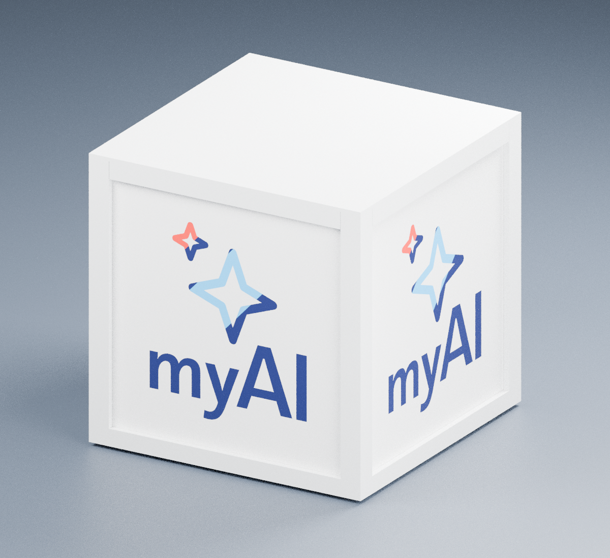
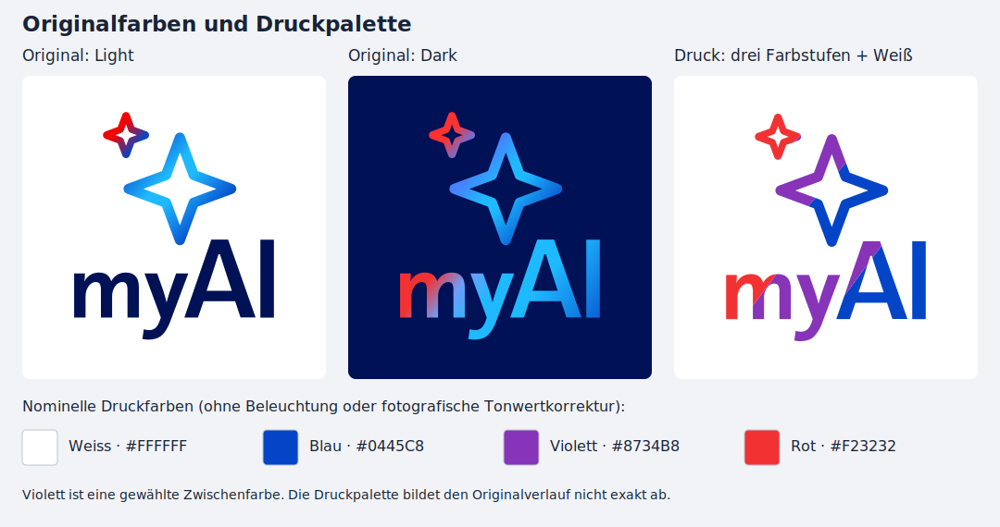
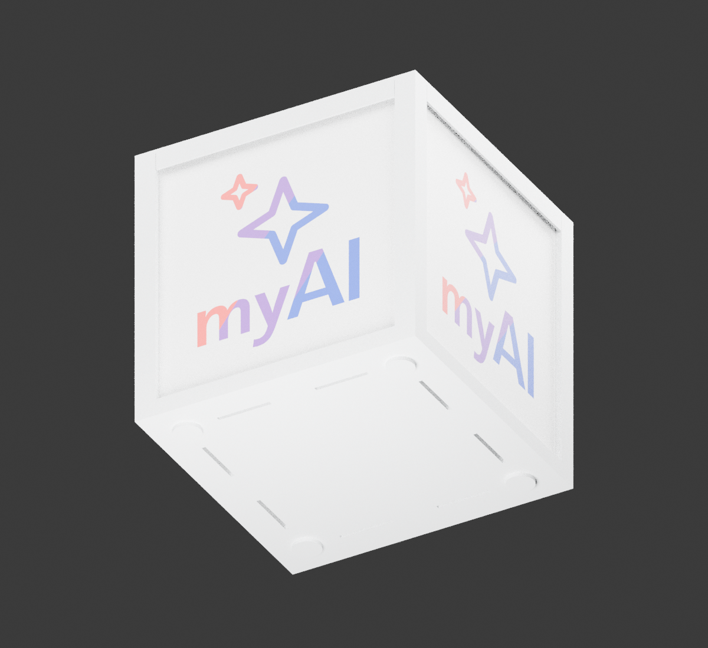
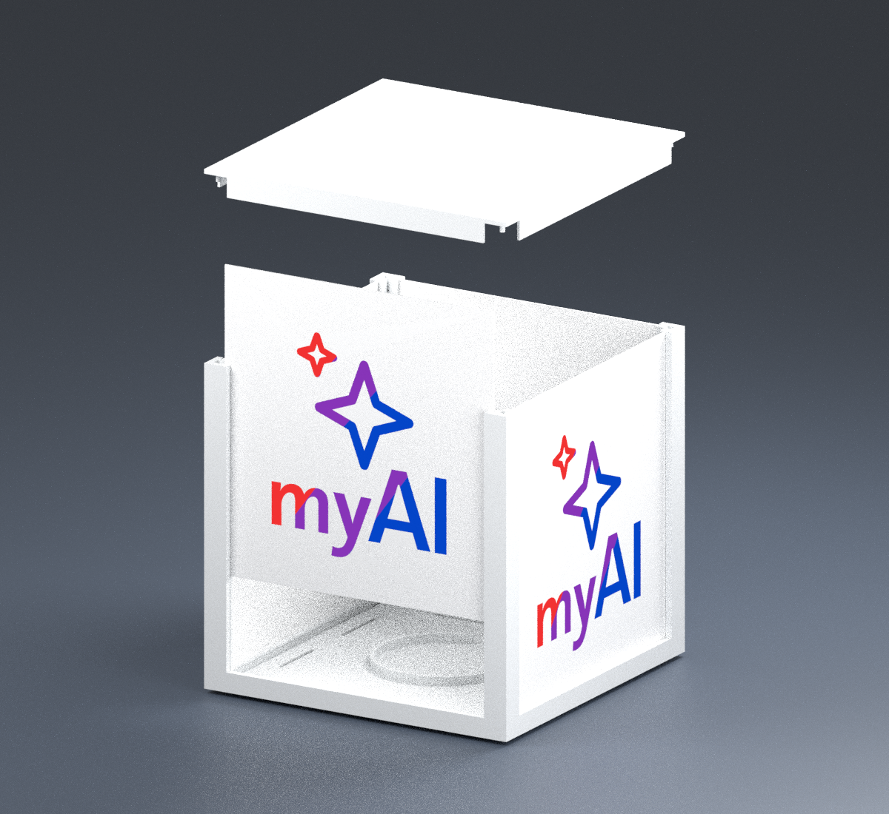

# myAI Cube v3.2.1 — Logo direkt mit dem AMS drucken

> Archivierter Entwurf mit zurückgesetzten Seitenfeldern. Der aktuelle Entwurf mit planen Seiten ist [v4](MEHRFARBIG_V4.md). Die folgenden Reproduktionsbefehle gelten für die Quellen im v3.2.1-Archiv; die aktuellen Quellen im Repository erzeugen v4.

Der Würfel bleibt **150 × 150 × 150 mm einschließlich Füßen** groß. Vier identische, flach gedruckte Leuchtpaneele werden von oben in einen weißen Rahmen eingeschoben. Das mehrfarbige Logo ist bündig in jedes Paneel integriert. Der abnehmbare Deckel schließt die Führungen. Die Logos benötigen keinen Klebstoff.



*Technische Farbansicht der tatsächlichen CAD-Geometrie. Die Logo-Flächen zeigen nominelle sRGB-Farben ohne Aufhellung durch Szenenbeleuchtung. Keine Vorhersage der Leuchtwirkung oder realer Filamentfarben.*

## Vier Farben in einem AMS

| Projekt-Filament | PLA-Farbe | Verwendung |
|---|---|---|
| 1 | Weiß | Paneel, Rückschicht, Rahmen, Boden, Deckel, Füße |
| 2 | Blau | Blaue Bereiche in Sternen und Schrift |
| 3 | Violett | Mittlere Farbstufe in Sternen und Schrift |
| 4 | Rot | Rote Bereiche in Sternen und Schrift |

Die Konturen stammen jetzt aus der unveränderten **dunklen Logo-SVG**: Sie enthält Farbverläufe sowohl in den Sternen als auch in „myAI“. Die zuvor verwendete helle SVG besitzt einfarbig dunkelblaue Schrift. Beide Originaldateien bleiben unverändert.

Die gewünschte Druckfolge ist **Rot → Violett → Blau**. Sterne und Schrift behalten ihre jeweils eigene Verlaufsrichtung aus der SVG; der Generator liest die Gradientenzuordnung jedes Pfads. Die Farbpalette wird für diesen Entwurf bewusst angepasst: Weiß `#FFFFFF`, Blau `#0445C8`, Violett `#8734B8`, Rot `#F23232`. Die Original-SVG enthält zusätzlich hellblaue/cyanfarbene Zwischenstufen, die hier durch die gewünschte dreistufige Folge ersetzt werden. Die Hexwerte dienen der Vorschau und sind keine gemessenen Filamentfarben.

Es ist eine **druckbare Vierfarben-Annäherung mit sichtbaren Farbkanten**, kein stufenloser Verlauf. Entlang jedes originalen Gradientenvektors wird bis t = 0,18 Rot, von t = 0,18 bis 0,50 Violett und danach Blau verwendet; auch innerhalb einzelner Buchstaben entstehen Farbwechsel. Diese Grenzen stehen in `gradient_band_edges` in den CAD-Parametern. Eine winzige separate Kontur unterhalb der Düsenauflösung entfällt wie bei den bisherigen Versionen.

### Farbvergleich und Vorschaukorrektur v3.2.1



Die vorherige 3D-Vorschau hellte die Farben durch Beleuchtung und fotografische Tonwertkorrektur stark auf. Rot `#F23232` und Blau `#0445C8` entsprechen bereits Farbstopps der dunklen Original-SVG; diese Werte bleiben erhalten. Violett `#8734B8` ist eine gewählte Zwischenfarbe, kein eigener Farbstopp in der Originaldatei.

Die neue technische Ansicht gibt die Logo-Farben direkt zur Kamera aus, ohne Beleuchtungsaufhellung und mit Standard-sRGB-Ausgabe. Weiße Gehäuseteile bleiben schattiert. Die farbigen Flächen sind dadurch **keine Simulation leuchtenden Filaments**. Der [Farbprüfbericht](../output/multicolor_v3/color_validation.json) prüft die Farbfelder der Vergleichsgrafik und große Innenflächen der gerenderten Logos gegen die CAD-Farbwerte.

**V3.2.1 ändert nur Darstellung, Prüfungen und Dokumentation.** Geometrie, Filamentprofile und geslicte Druckdateien sind identisch zu v3.2; kein erneuter Druck wegen dieser Vorschaukorrektur nötig. Wie dunkel die reale Lampe erscheint, hängt vom tatsächlich eingelegten Filament und der Beleuchtung ab. Hexwerte im Projekt ändern die Farbe einer realen Spule nicht.

Die Paneele sind **133,4 × 139,4 × 0,8 mm** groß. Außen liegen 0,4 mm tiefe Farbeinlagen und weißer Hintergrund, dahinter eine durchgehende 0,4-mm-Schicht aus Weiß. Das Logo ist auf jeder montierten Würfelseite bei **75 / 75 mm** zentriert. Farbflächen dämpfen das Licht anders als weißes PLA; Farbe und Kontrast müssen mit dem eigenen Filament geprüft werden.

## Druckdateien

Alle Links führen zu geslicten **Bambu-Studio-Projekten** für P1S, 0,4-mm-Düse, 0,20-mm-Schichten und strukturierte PEI-Platte. Ein Paneel pro Druckplatte; viermal unverändert drucken.

| Druckprojekt | Anzahl | Slicer-Zeit je Druck | PLA je Druck¹ |
|---|---:|---:|---:|
| [Farb- und Lichtprobe](../output/multicolor_v3/print/01_color_test_P1S.3mf) | zuerst 1 | 34 min | 7,05 g |
| [Seitenpaneel mit Logo](../output/multicolor_v3/print/02_panel_P1S.3mf) | 4 | 91 min | 23,24 g |
| [Rahmen](../output/multicolor_v3/print/03_frame_P1S.3mf) | 1 | 5 h 52 min | 69,56 g |
| [Boden / LED-Aufnahme](../output/multicolor_v3/print/04_base_P1S.3mf) | 1 | 3 h 51 min | 76,27 g |
| [Deckel](../output/multicolor_v3/print/05_lid_P1S.3mf) | 1 | 2 h | 31,66 g |
| [Vier Füße auf einer Platte](../output/multicolor_v3/print/06_feet_P1S.3mf) | 1 Satz | 15 min | 1,90 g |

¹ Einschließlich Brim, Spülmaterial und Reinigungsturm, soweit vom Slicer erfasst. Lampe ohne Testprobe insgesamt etwa **272 g PLA und 18 h 2 min**. Es werden keine Stützen erzeugt. Jedes Paneel benötigt sechs Farbwechsel. Der Boden druckt mit der flachen Unterseite auf dem Bett; lediglich die kleinen, 4,4 mm breiten Fußaufnahmen werden oben überbrückt. Die Füße drucken mit dem runden Pad auf dem Bett und dem Zapfen nach oben.

**[Komplettes Druck- und Quellenpaket v3.2.1 herunterladen](../output/myAI_Cube_150_P1S_AMS_v3_2_1.zip)**. Das Paket enthält zusätzlich die bisherige einfarbige v2; für diesen Entwurf die Dateien unter `output/multicolor_v3/print/` verwenden. Die älteren v3-, v3.1- und v3.2-Pakete bleiben als Archive erhalten.

1. Die Farbprobe **als Projekt** öffnen. Die vier Projekt-Filamente beim Senden den passenden realen AMS-Fächern zuordnen; die Datei kennt deine geladenen Spulen nicht. Für die weißen Druckprojekte Projekt-Filament 1 dem weißen Fach zuweisen.
2. Eigenes PLA und Druckplatte prüfen. Voreinstellung: Generic PLA, 220 °C Düse, 55 °C Bett. Bei Profil- oder Materialänderungen neu slicen und die Vorschau prüfen.
3. Die Logo-Vorderseite liegt auf dem Druckbett. Im Blick von oben erscheint die Rückseite entsprechend gespiegelt. **Nicht zusätzlich spiegeln oder wenden.** Alle vier Farbvolumen bleiben Teile eines gemeinsamen Objekts.
4. Zuerst die kleine Probe drucken und vor dem LED-Kit prüfen. Sie hat denselben Schichtaufbau, aber nur 35 % der Logo-Größe; sie dient dem Farb-/Lichtvergleich, nicht der Beurteilung feiner Details in Originalgröße oder der mechanischen Passung.
5. Danach einen Rahmen und zunächst ein vollständiges Paneel drucken. Brim sauber entfernen und den Sitz prüfen, bevor die drei übrigen Paneele gedruckt werden. Dünne Paneele erst vom abgekühlten Bett lösen und nicht stark knicken.

Der Reinigungsturm ist aktiviert. Spülen in die Leuchtflächen ist deaktiviert, damit Restfarben nicht in der weißen Rückschicht landen. Vorgesehen sind konservative Spülmengen von 650 mm³ beim Wechsel auf Weiß und 450 mm³ bei anderen Farbwechseln; anhand der Probe für das eigene Filament bewerten. Die kleinen Vorschaubilder innerhalb der 3MF-Dateien fehlen wegen des kopflosen CLI-Exports; die Geometrie und der geslicte G-Code sind enthalten.

## Verdeckte Belüftung



Die Seitenlöcher und die Schlitze auf der Deckelfläche entfallen. Die hintere Kabelöffnung bleibt erhalten.

- **Unten:** Vier separate Druckfüße mit 14 mm Durchmesser schaffen 2 mm Bodenfreiheit. Acht Schlitze à 28 × 2 mm liegen auf der Unterseite. Ihre gesamte nominelle Öffnungsfläche beträgt 448 mm². Der Boden ist nach innen versetzt: Der äußere Auflagerand ist 1 mm stark, die zentrale Platte 3 mm. So bleiben Außenmaße, Paneele und Logo-Position unverändert.
- **Oben:** Vier 100 mm breite und 1,2 mm hohe Kanäle liegen auf der Unterseite des Deckelrandes. Von dort führt die Luft hinter der 1,2 mm starken äußeren Blende nach unten ins Freie. Der Abstand zwischen Blende und Paneel beträgt 2,05 mm. Die Deckelfläche bleibt durchgehend 0,8 mm stark; keine Öffnungen von oben. Die Kanalquerschnitte ergeben zusammen nominell 480 mm².

Das CAD prüft zusammenhängende freie Luftwege vom Raum unter der Lampe bis zum Innenraum und vom Innenraum zu den verdeckten oberen Auslässen. **Das ist keine Strömungs- oder Wärmeberechnung.** Die Umlenkung am Deckel erzeugt einen Strömungswiderstand; die angegebenen Flächen belegen keine ausreichende Kühlleistung. Die Lampe auf eine harte, ebene Fläche stellen, damit die unteren Einlässe frei bleiben.

## Montage



1. Vier Füße in die runden Aufnahmen auf der Bodenunterseite stecken. Zapfen Ø 4,0 × 1,8 mm, Aufnahme Ø 4,4 × 2,0 mm: bewusst eine lose Passung. Mit wenig PLA-geeignetem Klebstoff fixieren; keine Lüftungsschlitze verschließen. Die 2 mm hohen Pads müssen flach anliegen. Für diesen Schritt ist zusätzlicher Klebstoff erforderlich.
2. LED Lamp Kit 001/MH001 in die nominell 60-mm-Aufnahme des Bodens setzen und mit dem vorgesehenen Klebepad befestigen. Die Auslegung basiert auf einem nominell 59-mm-Modul; tatsächliches Kit vor Montage prüfen. Die LED-Auflage liegt jetzt 5 mm über der Stellfläche. Kabel durch die offene Aussparung führen und den Verlauf zur hinteren Öffnung prüfen.
3. Rahmen auf den Boden setzen, die hintere Kabelöffnung ausrichten. Die Verbindung steckt lose auf dem Boden; kein verriegelter Transportgriff.
4. Vier Paneele von oben in die Führungen schieben, bedruckte Bettseite nach außen und Schrift aufrecht. Seitlich sind nominal 0,3 mm Spiel je Kante vorgesehen; durch die Dicke ergibt sich 0,25 mm vorne und 0,35 mm hinten. Paneele nicht gewaltsam einschieben.
5. Deckel aufsetzen. Seine seitlichen Blenden schließen die oberen Fenster und halten die Paneele in den Führungen. Den Luftspalt hinter der Blende frei lassen. Beim Tragen den Boden unterstützen.

**Rahmen, Boden, Deckel und Füße aus v3.1 passen unverändert zu v3.2.** Neu sind die Farbprobe und die Logo-Paneele mit der geänderten Farbaufteilung; ihre Außenmaße und Passungen bleiben gleich. Für die neuen Farben müssen die Paneele neu gedruckt werden. Der frühere geschlossene Boden aus v2/v3 hat keine Lufteinlässe und ist dafür ungeeignet. Den ersten Betrieb beaufsichtigen und die Temperatur an LED-Aufnahme, Boden und Deckel über einen längeren Betrieb bis zum stabilen Zustand prüfen. Wärmeverhalten und Passung sind noch nicht praktisch bestätigt.

## Quellen und digitale Prüfung

Maße/Farben: [Parameter](../cad/multicolor_parameters.json). Konturen, Rahmen, Boden, Füße und Montage: [Generator](../cad/build_multicolor.py). Die Original-SVGs bleiben unverändert. Die Ringgeometrie der LED-Aufnahme und Grundfunktionen werden aus dem v2-Generator importiert.

```sh
.venv/bin/python cad/build_multicolor.py
.venv/bin/python scripts/prepare_profiles.py /pfad/zu/BambuStudio/resources/profiles/BBL
.venv/bin/python scripts/slice_multicolor.py /pfad/zu/bambu-studio
.venv/bin/python scripts/validate_multicolor.py
blender -b -t 4 --python scripts/render_multicolor.py
.venv/bin/python scripts/render_color_reference.py
.venv/bin/python scripts/validate_colors.py
.venv/bin/python scripts/package.py
```

Python-Abhängigkeiten und Bambu-Studio-Einrichtung: [CAD & Validierung](CAD_UND_VALIDIERUNG.md). Verwendet: Bambu Studio 2.8.2.61. Der Slicer erzeugt zuerst eine native Mehrteil-Projektdatei; anschließend werden die vier Teile explizit den Filamenten zugeordnet und regulär geslict. G-Code wird nicht nachbearbeitet.

- [Geometrieprüfung](../output/multicolor_v3/geometry_validation.json): geschlossene Materialvolumen, vollständige Paneelabdeckung, keine relevanten Volumenüberschneidungen, kollisionsfreie Montage und Einschubbewegung, Außenmaße einschließlich Füßen und Logo-Zentrierung. Zusätzlich: alle drei Druckfarben auch im Schriftbereich, freie verbundene Luftwege, geschlossene Deckelfläche und geschlossene frühere Seitenöffnungen. Getrennte Buchstaben/Sternflächen sind absichtlich mehrere Inseln eines Materialteils; die Füße sind vier getrennte Körper auf einer Druckplatte. Boolesche Abweichungen an gemeinsamen Grenzflächen werden mit 0,001 mm³ Toleranz bewertet.
- [Druckprüfung](../output/multicolor_v3/print_validation.json): geschlossene exportierte STL-Netze, vier korrekte Materialzuordnungen ohne Slicer-Netzreparatur, G-Code-Prüfsummen, Bettgrenzen einschließlich Brim/Reinigungsturm, keine Stützen oder Slicer-Druckwarnungen. Farbausgabe bei Z = 0,2/0,4 mm, ausschließlich Weiß im Paneel bei Z = 0,6/0,8 mm.

**Stand: digital geprüfter und geslicter Prototyp, noch kein physisch getestetes Modell.** Passung, Verzug, Lichtdurchlässigkeit, Farbsauberkeit und Dauerbetrieb bleiben durch Probedruck und Betrieb zu prüfen.
