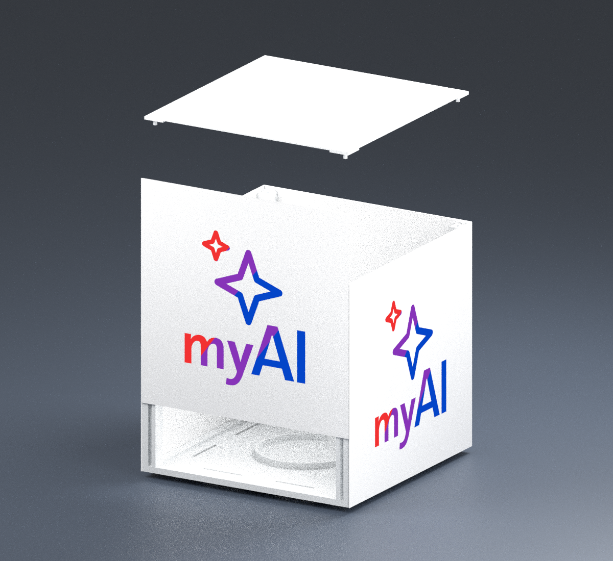
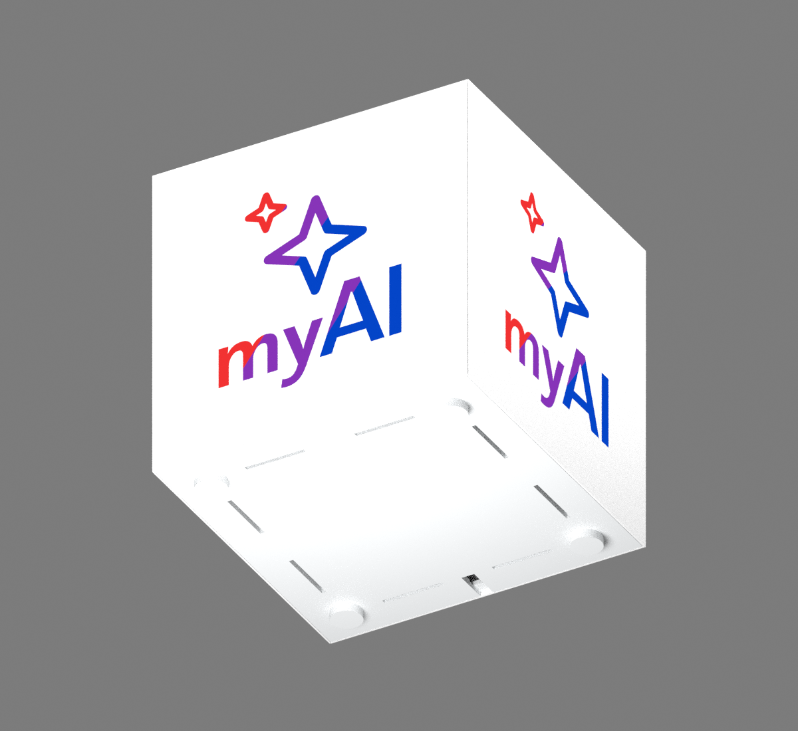

# myAI Cube v4 — vier durchgehend plane Seiten

Der Würfel misst **150 × 150 × 150 mm einschließlich Füßen**. Jede Seite besteht aus einer vollflächigen Platte mit bündig integriertem myAI-Logo. Es gibt keine vertieften Logo-Felder, vorstehenden Rahmen oder Deckelblenden an den Seiten. Die Befestigung liegt innen.


*Technische Farbansicht der CAD-Geometrie. Logo-Farben werden als nominelle sRGB-Werte dargestellt; keine Vorhersage realer Filamentfarben oder Leuchtwirkung.*

## Aufbau und Oberfläche

- Vier identische Platten: **149,6 × 146 mm**, Leuchtfläche **0,8 mm** stark. Die 0,4-mm-Farbeinlagen liegen bündig in der Vorderseite, dahinter bleiben 0,4 mm Weiß. Die schmalen inneren Führungsleisten erhöhen die lokale Druckhöhe auf 2,8 mm.
- Die Außenflächen liegen auf den Würfelebenen x/y = 0 und 150 mm. Die vertikalen Plattenkanten sind innen auf Gehrung geschnitten, mit 0,2 mm Abstand zur theoretischen Würfelkante. Es bleiben schmale Montagefugen an den vier Kanten; keine eingefassten Felder auf den Seiten.
- Zwei innenliegende, schwalbenschwanzförmige Leisten je Platte gleiten von oben in passende Nuten des inneren Rahmens. Nominell 0,2 mm Spiel um das Führungsprofil; der untere Anschlag trägt die Platte. Der Deckel begrenzt das Anheben. Die Platten werden nicht angeklebt.
- Die Logo-Kontur bleibt auf allen vier montierten Seiten bei **75 / 75 mm** zentriert. Rahmen, Boden und Deckel liegen hinter den Außenflächen.

Die Sichtseite liegt beim Druck auf dem Bett und übernimmt dessen Oberflächenstruktur. „Plan“ bezeichnet hier die Geometrie ohne Absatz; die vorbereitete strukturierte PEI-Platte erzeugt keine polierte Oberfläche. Die Ebenheit großer, dünner PLA-Platten und der Einfluss der inneren Leisten auf die Lichtwirkung müssen am Druck geprüft werden.

## Vier AMS-Farben

| Projekt-Filament | PLA-Farbe | Vorschauwert |
|---|---|---|
| 1 | Weiß | `#FFFFFF` |
| 2 | Blau | `#0445C8` |
| 3 | Violett | `#8734B8` |
| 4 | Rot | `#F23232` |

Sterne und Schrift folgen **Rot → Violett → Blau**. Konturen und Verlaufsrichtungen stammen aus der unveränderten dunklen Original-SVG. Die Farben bleiben gegenüber v3.2.1 erhalten: Rot und Blau sind originale Farbstopps, Violett ist eine gewählte Zwischenfarbe. Das AMS druckt klar getrennte Farbstufen, keinen stufenlosen Verlauf. Eine winzige separate Kontur unterhalb der Düsenauflösung entfällt.

[Direkter Vergleich mit beiden Original-SVGs](../output/multicolor_v4/preview/color_reference.png). Die Druckpalette bildet die zusätzlichen hellblauen/cyanfarbenen Zwischenstufen des Originals nicht exakt ab. Die reale Farbe bestimmt die eingelegte Spule.

## Druckdateien

**[Komplettes Druck- und Quellenpaket v4](../output/myAI_Cube_150_P1S_AMS_v4.zip)**. Im Paket die aktuellen Projekte unter `output/multicolor_v4/print/` verwenden; ältere Varianten liegen separat bei.

Alle Projekte sind für **P1S · 0,4-mm-Düse · PLA · 0,20-mm-Schichten · strukturierte PEI-Platte** ausgerichtet und geslict. Als Projekt in Bambu Studio öffnen und die Projekt-Filamente beim Senden den richtigen AMS-Fächern zuordnen. Bei Änderungen an Filament oder Druckplatte neu slicen. Voreinstellung: Generic PLA, 220 °C Düse und 55 °C Bett.

| Druckprojekt | Anzahl | Zeit je Druck | PLA je Druck¹ |
|---|---:|---:|---:|
| [Farb- und Lichtprobe](../output/multicolor_v4/print/01_color_test_P1S.3mf) | zuerst 1 | 36 min | 7,44 g |
| [Passprobe der inneren Führung](../output/multicolor_v4/print/07_fit_P1S.3mf) | zuerst 1 | 23 min | 2,18 g |
| [Vollflächige Seitenplatte](../output/multicolor_v4/print/02_panel_P1S.3mf) | 4 | 1 h 49 min | 28,34 g |
| [Innerer Rahmen](../output/multicolor_v4/print/03_frame_P1S.3mf) | 1 | 4 h 42 min | 53,70 g |
| [Boden mit LED-Aufnahme](../output/multicolor_v4/print/04_base_P1S.3mf) | 1 | 3 h 38 min | 74,32 g |
| [Deckel](../output/multicolor_v4/print/05_lid_P1S.3mf) | 1 | 1 h 24 min | 22,42 g |
| [Vier Füße auf einer Platte](../output/multicolor_v4/print/06_feet_P1S.3mf) | 1 Satz | 20 min | 3,41 g |

¹ Einschließlich Brim, Spülmaterial und Reinigungsturm, soweit vom Slicer erfasst. Lampe ohne Proben etwa **267 g PLA und 17 h 22 min**. Keine Stützen. Jedes Paneel benötigt sechs Farbwechsel.

1. Zuerst Farbprobe und Passprobe drucken. Die Farbprobe besitzt denselben 0,4 + 0,4-mm-Schichtaufbau, verkleinertes Logo und keine Führungsleisten. Sie beurteilt Farben und Licht, keine Details in Originalgröße.
2. Die Passprobe besteht aus einem 20 mm hohen Ausschnitt des echten Eckpfostens und einem passenden Plattenstreifen mit Führungsleiste, jeweils in der späteren Druckorientierung. Den Streifen aufrichten und die Leiste von oben in eine der beiden Nuten schieben. Die Verbindung soll gleiten, ohne Gewalt oder Aufspreizen des Pfostens. Diese Probe prüft den Querschnitt, noch nicht den Verzug über die volle Führungslänge.
3. Danach zunächst einen Rahmen und eine vollständige Seitenplatte drucken und montieren. Erst nach erfolgreicher Passprobe die übrigen drei Platten drucken. Dünne Platten vom abgekühlten Bett lösen; Brim und lose Fäden sorgfältig entfernen.
4. Die Logo-Vorderseite ist die Bettseite. **Nicht zusätzlich spiegeln oder wenden.** Die vier Farbvolumen bleiben Teile eines gemeinsamen Objekts. Die breitere Platte ist auf dem Bett seitlich versetzt, damit Brim und Reinigungsturm ausreichend Abstand haben.

Der Reinigungsturm ist aktiviert; Fremdfarben werden nicht in die weiße Rückschicht gespült. Vorgesehene Spülmengen: 650 mm³ beim Wechsel auf Weiß, 450 mm³ bei anderen Farbwechseln, anhand des eigenen Filaments prüfen. In den ersten zwei Schichten liegen alle vier Farben, darüber ausschließlich Weiß einschließlich der Führungsleisten. Die CLI-Dateien enthalten Geometrie und G-Code, aber keine integrierten Vorschaubilder.

## Montage und Belüftung



1. Vier Füße in die Aufnahmen auf der Bodenunterseite stecken und mit wenig PLA-geeignetem Klebstoff fixieren. Die 4-mm-Pads flach anlegen. Zapfen Ø 4,0 × 1,8 mm, Aufnahmen Ø 4,4 × 2,0 mm: bewusst eine lose Passung.
2. LED Lamp Kit 001/MH001 in die nominell 60-mm-Aufnahme setzen und mit dem Kit-Klebepad befestigen. Die Konstruktion verwendet ein nominell 59-mm-Modul; das konkrete Kit prüfen. Seine Auflage liegt 7 mm über der Stellfläche.
3. Kabel durch den nach hinten offenen, 6 mm breiten Bodenschlitz nach unten legen. Es verlässt die Lampe **unter** der hinteren Seitenplatte. Die Füße schaffen dafür 4 mm Bodenfreiheit. Den tatsächlichen Kabeldurchmesser und einen knickfreien Verlauf prüfen; kein Stecker muss durch eine geschlossene Bohrung gefädelt werden.
4. Rahmen auf die vier Führungsstifte des Bodens setzen. Vier Seitenplatten mit aufrechter Schrift und Bettseite nach außen von oben einschieben, bis die inneren Leisten auf den Anschlägen sitzen. Der Rahmen darf nicht gewaltsam gespreizt werden.
5. Deckel in die vier oberen Aufnahmen setzen. Zum Öffnen an der oberen Deckelfuge vorsichtig abheben. Boden und Deckel stecken lose; beim Tragen den Boden unterstützen.



Die Belüftung ist an die planen Seiten angepasst:

- **Einlass unten:** Acht Bodenschlitze à 28 × 2 mm, zusammen nominell 448 mm². Auf einer harten, ebenen Fläche bleiben sie durch die 4-mm-Füße offen.
- **Auslass oben:** Vier unterseitige Deckelkanäle à 120 × 1,2 mm führen in die **0,8 mm breite Montagefuge zwischen Deckel und Seitenplatten auf der Oberseite**. Dort beträgt der nominelle Austrittsquerschnitt über den vier Kanalabschnitten 384 mm². Diese schmale obere Fuge bleibt sichtbar und offen; die eigentliche Deckelfläche ist geschlossen. Es gibt keine vertieften Auslässe auf den Seiten.

Die Luftwege sind im montierten CAD frei und zusammenhängend. Das ist kein Nachweis ausreichender Kühlung. Temperatur an LED-Aufnahme, Boden und Deckel im beaufsichtigten Betrieb bis zum stabilen Zustand prüfen. Passung, Verzug, Lichtverteilung und Dauerbetrieb sind noch nicht physisch bestätigt.

**V4 als vollständigen neuen Teilesatz verwenden.** Die früheren Paneele, Rahmen, Böden, Deckel und Füße sind hierfür nicht vorgesehen. Die alten v3-Dateien und Versionspakete bleiben im Repository erhalten.

## Reproduzieren und prüfen

Quellen: [AMS-Parameter](../cad/multicolor_parameters.json), [Generator](../cad/build_multicolor.py). Grundfunktionen und LED-Ring werden aus `cad/build.py` importiert. `output_folder` wählt das aktuelle Ausgabeverzeichnis. Allgemeine Umgebung: [CAD & Validierung](CAD_UND_VALIDIERUNG.md).

```sh
.venv/bin/python cad/build_multicolor.py
.venv/bin/python scripts/prepare_profiles.py /pfad/zu/BambuStudio/resources/profiles/BBL
.venv/bin/python scripts/slice_multicolor.py /pfad/zu/bambu-studio
.venv/bin/python scripts/validate_multicolor.py
blender -b -t 4 --python scripts/render_multicolor.py
.venv/bin/python scripts/render_color_reference.py
.venv/bin/python scripts/validate_colors.py
.venv/bin/python scripts/package.py
```

Verwendeter Slicer: Bambu Studio 2.8.2.61. Die Prüfungen stehen in [Geometrie](../output/multicolor_v4/geometry_validation.json), [Druckdateien](../output/multicolor_v4/print_validation.json) und [Farben](../output/multicolor_v4/color_validation.json):

- Geschlossene Materialvolumen, vollständige Abdeckung der Platte einschließlich Leisten, keine relevanten Materialüberschneidungen, kollisionsfreie Montage und Einschubbewegung. Seitliches Herausziehen wird durch die Führungsgeometrie blockiert.
- Außenmaß 150³ mm, Logo-Zentrierung 75/75 mm und durchgehende ebene Außenhaut auf allen vier Seiten, mit Ausnahme der vorgesehenen schmalen Kantenfugen. Freie Luft- und Kabelwege. Die Boolesche Volumentoleranz beträgt 0,001 mm³.
- Sieben geslicte P1S-Projekte, korrekte AMS-Zuordnung, gültige G-Code-Prüfsummen, Bettgrenzen einschließlich Brim/Reinigungsturm, keine Stützen oder Slicer-Druckwarnungen.
- Nominelle RGB-Farben in den technischen Vorschauen; kein gemessener Farb- oder Helligkeitsnachweis am gedruckten Material.
