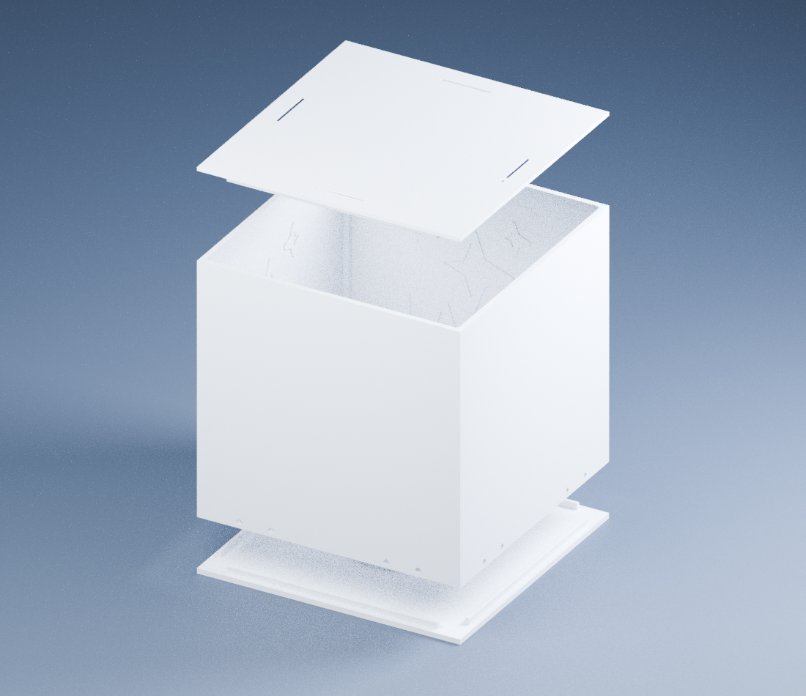

# Projektdetails — myAI Cube

3D-druckbare Würfellampe aus weißem PLA für das **Bambu Lab LED Lamp Kit 001 / MH001 (nominal Ø 59 mm)**. Vier gleiche Logo-Seiten, separate Bodenplatte, abnehmbarer Deckel. Zusammengesetzt **150 × 150 × 150 mm**.

**Version 2:** Die tatsächliche Logo-Kontur ist auf jeder montierten 150-mm-Seite geometrisch zentriert (Mitte bei 75 / 75 mm). Die Zentrierung berücksichtigt die leeren SVG-Ränder, Boden-/Deckelhöhe und die Neigung des inneren Reliefs. Das Logo bleibt ein integrierter Teil des weißen Drucks.

## Direkt zum Druck

Die fertig ausgerichteten, mit **Bambu Studio 2.8.2.61** geslicten P1S-Projekte liegen in [output/print](../output/print). Jede Datei enthält eine Druckplatte, das Modell, die Einstellungen und den erzeugten G-Code.

| Reihenfolge | Projekt | Inhalt | PLA, ca. | Zeit, ca. |
|---|---|---|---:|---:|
| 1 | [01_tests_P1S.3mf](../output/print/01_tests_P1S.3mf) | Vier Lichtproben, LED-Passring, zwei Steckproben | 28 g | 1 h 56 min |
| 2 | [02_body_P1S.3mf](../output/print/02_body_P1S.3mf) | Vierseitiger Lampenkörper, 145 mm hoch | 116 g | 9 h 19 min |
| 3 | [03_base_P1S.3mf](../output/print/03_base_P1S.3mf) | Boden, 3 mm plus innenliegende Aufnahmen | 89 g | 4 h 14 min |
| 4 | [04_lid_P1S.3mf](../output/print/04_lid_P1S.3mf) | Deckel, außen bündig; Führung innen | 34 g | 2 h 9 min |

**Profil:** P1S, 0,4-mm-Düse, weißes Generic PLA, strukturierte PEI-Platte, 0,20-mm-Schichten, Arachne, zwei Wände, 100 % Füllung, keine Stützen, 4-mm-Außenbrim. Das eingebettete Filamentprofil verwendet 220 °C Düse und 55 °C Bett. Keine AMS-Farbwechsel.

1. `01_tests_P1S.3mf` in Bambu Studio **als Projekt** öffnen und im Maßstab 100 % belassen.
2. P1S mit 0,4-mm-Düse, die tatsächlich verwendete Druckplatte und dein weißes PLA auswählen. Wenn du ein anderes Filament- oder Plattenprofil verwendest, erneut slicen. Die Ausrichtung beibehalten.
3. Testplatte drucken. [Passung und Licht prüfen](DRUCK_UND_MONTAGE.md), danach die drei Hauptplatten drucken.

Die Lampe selbst benötigt etwa **238 g PLA / 15 h 42 min**. Die Angaben sind Slicer-Schätzungen inklusive Brim; tatsächliche Werte können abweichen. Die Konstruktion wurde digital geprüft und geslict, **noch nicht physisch probegedruckt**.

## Konstruktion

- Leuchtflächen und Deckelmitte: 0,8 mm. Randbereiche: 3 mm am Körper, 2 mm am Deckel. Verstärkte Ecken.
- Vollständiges gestapeltes myAI-Logo auf allen vier Seiten. Einfarbiges Relief **innen**, außen ebene Flächen. Das Logo ist mit insgesamt etwa 1,6 mm Material dicker und soll bei Beleuchtung dunkler erscheinen; Farbverläufe sind nicht Bestandteil des Drucks.
- LED-Aufnahme: Ø 60,0 mm innen, 4 mm hoch, mit Kabelschlitz. Die mitgelieferte Ø-40-mm-Klebescheibe fixiert das Kit am Boden. Die Führung ist keine Klemm- oder Schraubverbindung.
- 0,35 mm Spiel je Seite an den Führungsleisten. Körper und Deckel sitzen lose auf; sie sind abnehmbar und verriegeln nicht.
- Kabelauslass hinten, unten offen, 6 mm breit. Vier kleine Lüftungsöffnungen pro Seitenwand und vier Schlitze im Deckel.



Ansicht aus den tatsächlichen Druckmeshes. Die zusätzliche [Beleuchtungsansicht](../output/preview/assembled.png) ist eine schematische Materialsimulation, keine Vorhersage der Helligkeit oder des Logokontrasts.

## Dateien und Änderungen

- [STL-Einzelteile](../output/stl): Millimeter, bereits in Druckorientierung.
- [CAD-Parameter](../cad/parameters.json) und [Generator](../cad/build.py): reproduzierbare Geometrie.
- [Druck- und Montageanleitung](DRUCK_UND_MONTAGE.md).
- [Geometrieprüfung](../output/validation.json) und [Druckdateiprüfung](../output/print_validation.json).
- [Original-Logos](../assets/logos): unverändert. Für den Druck wird die Kontur der Light-Variante benutzt; ein winziges, nicht druckbares SVG-Dreiecksfragment wird beim Ableiten entfernt.

```sh
python3 -m venv .venv
.venv/bin/pip install -r cad/requirements.txt
.venv/bin/python cad/build.py
```

Nach Parameteränderungen sind die vorhandenen P1S-Druckprojekte veraltet: die neuen Geometrie-3MFs in `output/3mf` erneut slicen. Die Geometrieprüfungen laufen beim Erzeugen automatisch. Für die CLI-Reproduktion siehe [CAD und Validierung](CAD_UND_VALIDIERUNG.md).

## Quellen

- [Bambu LED Lamp Kit 001: Herstellerdaten](https://asia.store.bambulab.com/products/led-lamp-kit-001?modelId=126239&skr=yes): nominal Ø 59 mm, USB 5 V, 3 W. Die Aufnahme hält nur den unteren Rand; sie setzt keine bestimmte Gesamthöhe des Kits voraus.
- [Bambu 3D Printing Night Light Design Guidelines, PDF-Spiegel](https://www.eel3dshop.com/shop_ordered/54291/pic/Datasheet/BambuLab/LED_Lamp_Kit-001_Design_Guide.pdf): 0,8-mm-Lampenschirm und Belüftung als Konstruktionsgrundlage.
- [Bambu Studio 2.8.2.61](https://github.com/bambulab/BambuStudio/releases/tag/v02.08.02.61): offizieller Slicer und mitgelieferte P1S-/PLA-Profile.
